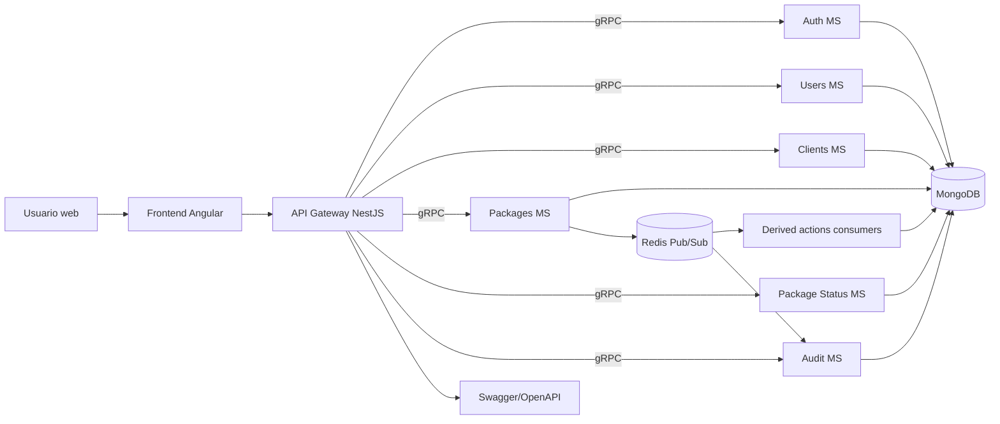
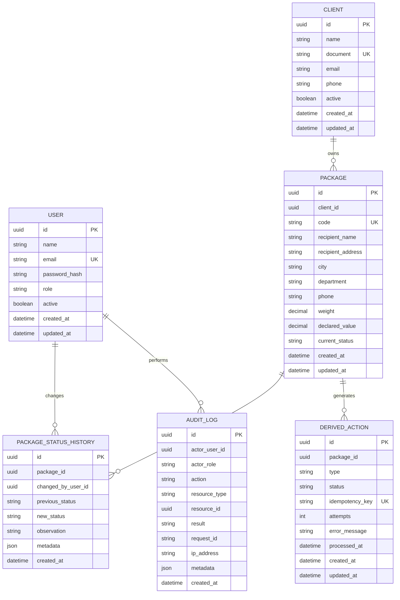
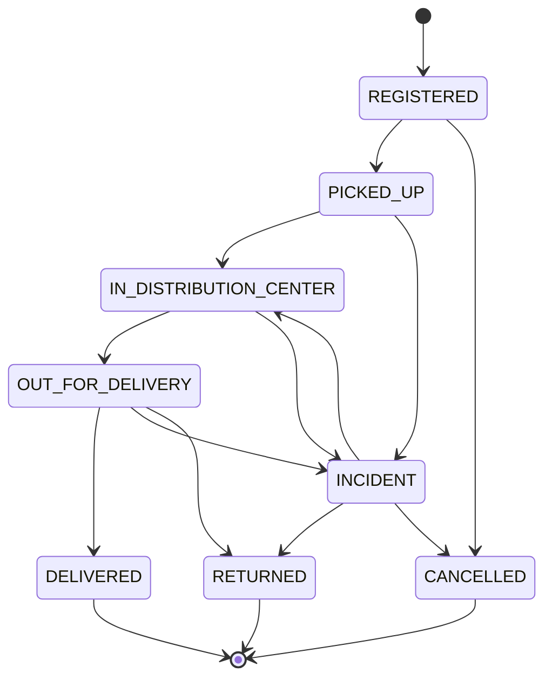
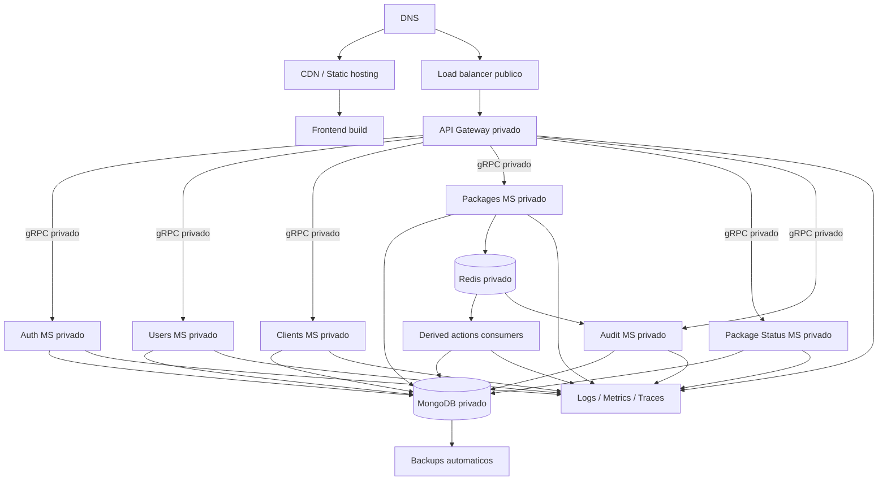

# tech-test-enviexpress

Arquitectura propuesta para una plataforma pequena de gestion logistica. El foco es entregar una solucion funcional en 3 dias, con backend, frontend, persistencia real, procesos derivados no bloqueantes y una propuesta productiva defendible.

## Objetivo

Construir una aplicacion para:

- Gestionar usuarios, roles y permisos.
- Registrar clientes y paquetes.
- Controlar cambios de estado con reglas de negocio.
- Guardar trazabilidad completa de cada paquete.
- Procesar acciones derivadas de forma asincrona.
- Consultar operacion mediante listados, filtros y dashboard.
- Explicar una ruta clara de despliegue seguro en cloud.

## Stack elegido

### Backend

- **NestJS + TypeScript**: estructura modular, inyeccion de dependencias, guards, pipes, interceptors y buen soporte para testing.
- **NestJS Microservices**: separacion agil de logica usando transportes soportados por NestJS, sin pagar el costo completo de una arquitectura distribuida desde el primer dia.
- **API Gateway NestJS**: unico punto de entrada HTTP para el frontend; centraliza CORS, autenticacion perimetral, rate limit, Swagger y enrutamiento hacia microservicios internos.
- **gRPC interno**: comunicacion sincrona entre gateway y microservicios cuando se necesita respuesta inmediata, por ejemplo login, usuarios, clientes, paquetes y consulta de estado.
- **MongoDB**: persistencia documental simple, rapida de levantar localmente y flexible para guardar paquetes, historial y acciones derivadas sin sobredimensionar la prueba.
- **Mongoose**: schemas, validaciones, indices y modelos tipados para mantener disciplina sobre MongoDB desde la capa de codigo.
- **Redis Pub/Sub**: comunicacion asincrona entre microservicios para acciones derivadas y eventos de dominio, evitando bloquear la operacion principal.
- **JWT + RBAC**: autenticacion simple y autorizacion por rol/permisos.
- **Swagger/OpenAPI**: documentacion reproducible de API.

### Frontend

- **Angular 22 + TypeScript**: framework opinionado, buen soporte para modulos/rutas, formularios reactivos, interceptores HTTP, guards y una estructura mantenible para una prueba con varios flujos.
- **NgRx Store/Effects**: estado predecible para sesion, filtros, dashboard y flujos que requieren sincronizacion entre vistas.
- **CQRS frontend del template**: comandos, queries, eventos, handlers y facades para separar presentacion, orquestacion y acceso a datos.
- **Angular HttpClient interceptors + wrapper HTTP compartido con Axios**: capa centralizada para token, `requestId`, timeout y mapeo de errores.
- **Angular i18n**: base para textos localizados; el template incluye mensajes base y `es-CO`.
- **Tailwind CSS + Flowbite**: componentes visuales y estilos utilitarios para construir rapido una interfaz operativa.
- **Vitest**: pruebas unitarias del frontend.

### Infraestructura local

- **Docker Compose** para levantar MongoDB en replica set de un nodo y Redis.
- API Gateway, microservicios, Redis, MongoDB y frontend ejecutables localmente con comandos separados.

### Alternativas descartadas

- **Next.js fullstack**: util, pero mezcla responsabilidades que la prueba pide separar claramente: frontend, backend, base de datos y procesos asincronos.
- **React + Vite**: tambien seria suficiente, pero el proyecto ya parte de un template Angular con CQRS, NgRx, i18n, interceptores y convenciones de arquitectura que aceleran la entrega.
- **GraphQL**: se considera por su flexibilidad para consultas de dashboard y detalle, pero se descarta para esta prueba porque agrega schema, resolvers, autorizacion por campo y convenciones extra. REST/OpenAPI es mas directo, facil de probar y suficiente para los flujos requeridos.
- **PostgreSQL**: se considera por sus restricciones relacionales e integridad referencial, pero se descarta para esta prueba buscando mayor simplicidad operativa y velocidad de implementacion. La integridad se compensa con validaciones rigurosas, transacciones de MongoDB cuando aplique e indices bien definidos.
- **BullMQ**: util para colas con reintentos avanzados, pero se evita para mantener la solucion mas cercana al soporte nativo de NestJS Microservices y demostrar comunicacion por eventos con Redis Pub/Sub.
- **RabbitMQ/SQS desde el inicio**: validos en produccion, pero Redis Pub/Sub reduce complejidad para 3 dias y mantiene la asincronia demostrable.
- **HTTP directo desde el frontend a cada microservicio**: se descarta para evitar exponer topologia interna, duplicar CORS/autenticacion y acoplar el frontend a varios contratos. El frontend consume solo el API Gateway.
- **Microservicios completos por cada subcapacidad pequena**: se consideran, pero se agrupan por dominio para no fragmentar demasiado. La separacion minima queda en gateway, auth, users, clients, packages, package-status y audit.
- **Notificaciones externas**: se omiten correos, SMS, WhatsApp, push notifications y alertas externas ante errores asincronos. Para una primera entrega se considera innecesario por costo, configuracion de proveedores, manejo de plantillas, cuotas, reintentos externos y credenciales adicionales.

## Arquitectura logica



### Componentes

- **Frontend**: aplica permisos visuales, formularios, listados paginados, filtros, dashboard y detalle de paquete.
- **API Gateway**: unico endpoint publico para el frontend. Valida el JWT a nivel perimetral, aplica rate limit/CORS, documenta REST con Swagger y llama microservicios internos por gRPC.
- **Base de datos**: fuente de verdad para usuarios, clientes, paquetes, historial y acciones derivadas.
- **Auth Microservice**: login, emision/validacion de tokens, hash de password y resolucion de sesion actual.
- **Users Microservice**: gestion de usuarios, roles y estado activo/inactivo.
- **Clients Microservice**: registro, edicion y consulta de clientes.
- **Packages Microservice**: registro de paquetes, cambios de estado, maquina de estados, historial y publicacion de eventos de dominio.
- **Package Status Microservice**: microservicio NestJS especifico para consultar estado, historial y trazabilidad de paquetes sin mezclar esa lectura operativa con comandos de escritura.
- **Audit Microservice**: crea y consulta registros de auditoria de diferentes entidades. Recibe eventos auditables y tambien expone gRPC para consultas administrativas.
- **Derived actions**: concepto transversal para acciones generadas por cambios de estado. No es un microservicio independiente; se implementa como consumidores/event handlers dentro de `packages-ms` o como proceso interno del mismo dominio.
- **Estadisticas operativas**: no son un microservicio separado; cada microservicio expone sus consultas estadisticas propias y el API Gateway compone el resumen del dashboard cuando sea necesario.
- **gRPC**: canal interno sincrono gateway-microservicios, con contratos `.proto` versionables.
- **Redis**: broker Pub/Sub para eventos asincronos entre microservicios.

## Modulos backend

```text
apps/
  api-gateway/
    src/
      application/
      domain/
      infrastructure/
  auth-ms/
    src/
      application/
      domain/
      infrastructure/
  users-ms/
    src/
      application/
      domain/
      infrastructure/
  clients-ms/
    src/
      application/
      domain/
      infrastructure/
  packages-ms/
    src/
      application/
      domain/
      infrastructure/
  package-status-ms/
    src/
      application/
      domain/
      infrastructure/
  audit-ms/
    src/
      application/
      domain/
      infrastructure/
libs/
  shared/
    src/
      application/
      domain/
      infrastructure/
        contracts/
          proto/     Contratos gRPC versionables
          events/    Contratos de eventos Redis Pub/Sub
        driven-adapters/
          grpc/      Clientes gRPC internos
          redis/     Cliente Redis Pub/Sub
```

Cada app conserva la estructura del template backend, pero sin agregar un nivel `contexts` dentro de cada microservicio. La separacion por dominio ya esta dada por la app (`auth-ms`, `users-ms`, `packages-ms`, etc.):

```text
src/
  application/
    config/          Configuracion propia del contexto
    providers/       Providers de use cases, handlers y gateways
    <app>.module.ts
  domain/
    models/
      entities/
      value-objects/
      gateways/
      cqrs/
        commands/
        queries/
        events/
    use-cases/
  infrastructure/
    ui/
      controllers/
      cqrs-handlers/
        command-handlers/
        query-handlers/
        event-handlers/
    driven-adapters/
    dtos/
  index.ts
```

Responsabilidad por app:

- `api-gateway`: controladores HTTP publicos, Swagger, guards, CORS, rate limit y clientes gRPC hacia microservicios.
- `auth-ms`: login, emision/validacion de JWT, hash de password y sesion actual.
- `users-ms`: usuarios, roles, permisos y estado activo/inactivo.
- `clients-ms`: gestion de clientes.
- `packages-ms`: paquetes, cambios de estado, historial, eventos Redis, `domain/state-machine` y `domain/derived-actions`.
- `package-status-ms`: consultas optimizadas de estado, historial y trazabilidad.
- `audit-ms`: creacion y consulta de auditorias por entidad, usuario y accion.

`libs/shared` toma el `shared` del template backend como libreria reutilizable. No representa un dominio de negocio; contiene configuracion comun con `ConfigModule`, validacion de variables de entorno con Joi, errores, paginacion, value objects base, filtros, interceptores, logger, MongoDB, JWT, cliente de auditoria y helpers de NestJS. El modulo principal de cada app importa `SharedModule`.

## Rutas frontend

```text
/login
/dashboard
/clients
/clients/new
/packages
/packages/new
/packages/:id
/derived-actions
/users
```

La interfaz debe ocultar acciones no permitidas, pero la seguridad real se aplica siempre en backend.

## Arquitectura frontend Angular

El repositorio ya incluye un template Angular en `frontend/` con separacion por contextos, capas y utilidades compartidas.

```text
frontend/src/app/
  core/
    config/          Configuracion de ambiente y tokens
    cqrs/            Commands, queries, events, handlers y buses
    errors/          Errores normalizados de aplicacion
    http/            Interceptores de auth, requestId, timeout y errores
    i18n/            Locales soportados y providers
    utils/           Integraciones como Flowbite
  shared/
    components/      UI reutilizable
    http/            Cliente HTTP compartido
    models/          Modelos comunes como paginacion
    store/           Estado global compartido
    value-objects/   Value objects reutilizables
  contexts/
    auth/
    users/
    clients/
    packages/
    derived-actions/
    dashboard/
```

El template actual trae `auth`, `users` y `products` como contextos iniciales. Para este dominio, `products` debe reemplazarse o evolucionar a `packages`, y se agregan `clients`, `derived-actions` y `dashboard`.

Cada contexto debe seguir esta estructura cuando la capa sea necesaria:

```text
context-name/
  domain/            Entidades, modelos y value objects del frontend
  application/       Commands, queries, handlers, services y facades
  infrastructure/    API services, DTOs, mappers y repositories
  presentation/      Pages, templates, organisms, molecules, atoms
  routes.ts
```

Reglas frontend:

- Las pages dependen de facades.
- Las facades orquestan CQRS, NgRx y servicios de aplicacion.
- Los componentes no llaman HTTP directamente.
- Los DTOs representan contratos de API; los modelos de dominio/UI representan estado de pantalla.
- Los mappers no implementan reglas de negocio del backend.
- Las rutas de cada contexto se cargan de forma lazy cuando el contexto tenga paginas.

## Roles y permisos

| Rol | Permisos |
| --- | --- |
| Administrador | Gestionar usuarios, gestionar clientes, consultar paquetes, consultar dashboard |
| Operador | Crear paquetes, cambiar estados, consultar clientes, consultar paquetes |
| Cliente | Consultar su historial de paquetes y rastrear estados de paquetes asociados a su cuenta |

Los permisos se validan en el API Gateway para rechazos tempranos, en cada microservicio para seguridad real del dominio y con helpers de autorizacion en frontend.

### Credenciales de prueba

El backend crea usuarios semilla para probar el panel operativo:

| Rol | Email | Password |
| --- | --- | --- |
| Administrador | `admin@enviexpress.test` | `Admin123!` |
| Operador | `operador@enviexpress.test` | `Operator123!` |
| Cliente | `cliente@enviexpress.test` | `Client123!` |

Datos adicionales para probar flujos de cliente:

| Flujo | Guia | Email asociado |
| --- | --- | --- |
| Historial de cliente con usuario existente | `ENV-DEMO-001` | `cliente@enviexpress.test` |
| Historial de cliente con usuario existente | `ENV-DEMO-002` | `cliente@enviexpress.test` |
| Registro de cliente sin usuario previo | `ENV-REG-001` | `registro@enviexpress.test` |

Para probar registro de cliente, usar `ENV-REG-001`, confirmar `registro@enviexpress.test` y asignar una contrasena desde el formulario.

## Modelo de datos



### Restricciones e indices

- `users.email` indice unico.
- `clients.document` indice unico.
- `packages.code` indice unico.
- `packages.client_id` indexado para consultas por cliente.
- `packages.current_status` indexado para filtros y dashboard.
- `packages.city` indexado para consulta operativa.
- `packages.created_at` indexado para filtros por rango.
- Indice compuesto `packages.client_id, current_status, created_at` para listados frecuentes.
- Indice compuesto `package_status_history.package_id, created_at` para trazabilidad cronologica.
- Indice compuesto `derived_actions.status, created_at` para dashboard y reintentos.
- `derived_actions.idempotency_key` indice unico para evitar duplicados.
- Indice compuesto `audit_logs.resource_type, resource_id, created_at` para auditoria por entidad.
- Indice compuesto `audit_logs.actor_user_id, created_at` para auditoria por usuario.
- Indice `audit_logs.request_id` para correlacionar llamadas HTTP/gRPC y eventos.
- Todos los documentos tienen `id` UUID generado por la capa de codigo con indice unico como identificador funcional.
- `_id` de MongoDB se conserva solo como identificador tecnico interno y no se expone por API.

### Integridad con MongoDB

MongoDB no impone llaves foraneas como una base relacional, asi que la integridad se resuelve de forma explicita en la capa de dominio y persistencia:

- **UUID desde codigo**: cada agregado genera su `id` con UUID v4 o UUID v7 antes de persistir. Las referencias entre colecciones usan esos UUID, no `_id`/`ObjectId` de MongoDB.
- **Schemas estrictos con Mongoose**: campos requeridos, enums, tipos, longitudes, minimos para peso/valor declarado y timestamps obligatorios.
- **DTOs validados en la entrada**: `class-validator` o Zod antes de llegar al caso de uso.
- **Validaciones de existencia**: antes de crear un paquete se verifica que `client_id` exista y que el cliente este activo.
- **Validaciones de referencia**: antes de registrar historial o accion derivada se verifica que el paquete exista.
- **Indices unicos**: `email`, `document`, `code` e `idempotency_key` se protegen desde MongoDB, no solo desde codigo.
- **Transacciones de MongoDB**: el cambio de estado, insercion de historial y creacion de accion derivada se ejecutan en una misma sesion transaccional. Para esto, local y produccion deben usar replica set, aunque localmente sea de un solo nodo.
- **Maquina de estados dentro de `packages-ms`**: las transiciones validas pertenecen al dominio de paquetes, no dependen del controlador ni de la base de datos, y se prueban de forma aislada dentro de ese microservicio.
- **Repositorios por agregado**: los microservicios no manipulan colecciones libremente; pasan por repositorios que concentran consultas, proyecciones e invariantes.
- **Filtros controlados**: los filtros de listado se construyen desde una whitelist de campos permitidos para evitar consultas inseguras o costosas.
- **Normalizacion controlada**: se guardan referencias por UUID; solo se desnormalizan datos estables si mejoran lecturas operativas, por ejemplo nombre del cliente en una vista de listado.
- **Pruebas de integracion**: cubren duplicados, cliente inactivo, paquete inexistente, transiciones invalidas e idempotencia de acciones derivadas.

## Auditoria

La auditoria se maneja mediante `audit-ms`, un microservicio dedicado a crear y consultar registros de auditoria de las entidades del sistema.

- Cada comando sensible genera un registro de auditoria: login, creacion/edicion de usuarios, cambios de clientes, creacion de paquetes, cambios de estado, reintentos de acciones derivadas y operaciones administrativas.
- Cada evento auditable incluye `requestId`, `actorUserId`, `actorRole`, `resourceType`, `resourceId`, `action`, `result` y `metadata` minima.
- El API Gateway genera o propaga `requestId` y los microservicios lo conservan en llamadas gRPC, eventos Redis y registros de auditoria.
- Los microservicios publican eventos auditables por Redis o llaman a `audit-ms` por gRPC cuando necesitan confirmacion sincrona.
- `audit-ms` centraliza persistencia, indices y consultas de auditoria por entidad, usuario, accion, resultado y rango de fechas.
- Los cambios de estado mantienen dos rastros: `package_status_history` para trazabilidad operativa del paquete y `audit_logs` para auditoria transversal de seguridad/operacion.
- Los registros de auditoria son append-only desde la aplicacion; no se editan desde flujos normales.
- Las consultas de auditoria se protegen con permisos de administrador y filtros obligatorios por fecha, usuario, recurso o accion.

## Estados y transiciones

La regla de estados vive dentro de `packages-ms` y se implementa con el patron **maquina de estados finitos**. Cada estado conoce sus transiciones permitidas, validaciones requeridas y efectos derivados. Esto evita condicionales dispersos, facilita agregar una nueva regla en vivo y permite probar el flujo de estados como una unidad aislada.

Estados minimos:

- `REGISTERED`
- `PICKED_UP`
- `IN_DISTRIBUTION_CENTER`
- `OUT_FOR_DELIVERY`
- `DELIVERED`
- `INCIDENT`
- `RETURNED`
- `CANCELLED`

Transiciones permitidas:



Reglas obligatorias:

- Un paquete `DELIVERED` no puede volver a `OUT_FOR_DELIVERY`.
- Un paquete `CANCELLED` no puede cambiar a otro estado.
- Un paquete `RETURNED` no puede marcarse como `DELIVERED` directamente.
- Para marcar `DELIVERED` se requiere `receivedBy`.
- Para marcar `INCIDENT` se requiere `observation`.
- Todo cambio de estado se ejecuta en transaccion de MongoDB: actualizar paquete, insertar historial y crear accion derivada.
- El resultado de la transicion publica un evento de dominio por Redis Pub/Sub para que otros microservicios reaccionen sin bloquear la respuesta.

## Procesos derivados

Los cambios de estado que generan acciones:

| Estado nuevo | Accion derivada | Tipo |
| --- | --- | --- |
| `DELIVERED` | Generar registro de liquidacion | `SETTLEMENT` |
| `INCIDENT` | Generar alerta operativa | `OPERATIONAL_ALERT` |
| `RETURNED` | Generar accion pendiente de revision | `RETURN_REVIEW` |

Flujo:

1. El frontend llama al API Gateway.
2. El API Gateway valida JWT/permisos basicos y llama por gRPC a `packages-ms`.
3. `packages-ms` valida reglas, ejecuta la maquina de estados y guarda el cambio de estado e historial en MongoDB.
4. `packages-ms` crea una `derived_action` en estado `PENDING` con `idempotency_key`.
5. `packages-ms` publica un evento Redis Pub/Sub, por ejemplo `package.status.changed`, y responde al gateway.
6. El API Gateway responde al frontend sin esperar el procesamiento derivado.
7. Los handlers de `derived-actions` del dominio de paquetes consumen el evento y marcan la accion como `PROCESSED` o `FAILED`.
8. Si falla, se guarda `error_message` y `attempts` para consulta y reintento.

La idempotencia se basa en:

```text
packageId + newStatus + actionType + historyId
```

Esto permite reintentar eventos o reprocesar acciones pendientes sin duplicar liquidaciones, alertas o revisiones.

### Notificaciones externas

No se incluyen notificaciones por correo, SMS, WhatsApp, push notifications ni avisos externos ante fallos de procesos asincronos. Para una primera entrega se consideran innecesarias por el costo y complejidad de integrar proveedores, manejar plantillas, cuotas, credenciales, reintentos externos y trazabilidad de entrega.

Los errores asincronos quedan visibles dentro del sistema mediante acciones derivadas en estado `FAILED`, auditoria, logs estructurados y metricas/alertas internas. Esa evidencia es suficiente para operar y defender la prueba tecnica sin depender de servicios pagos o configuracion externa.

### Microservicio de estado de paquete

El microservicio `package-status` expone consultas especializadas sobre estado, historial y trazabilidad. El API Gateway se comunica con este microservicio por gRPC para responder al frontend de forma sincrona.

Responsabilidades:

- Consultar estado actual de un paquete por codigo o id.
- Consultar historial cronologico.
- Preparar respuestas optimizadas para la pantalla de detalle.
- Aislar consultas operativas de alto uso para poder escalar este proceso de forma independiente si crece el volumen.

No ejecuta cambios de estado. Las escrituras siguen pasando por `packages-ms` para mantener transacciones, autorizacion y reglas de negocio centralizadas.

## API esperada

El frontend consume exclusivamente el API Gateway por HTTP/REST. El Gateway traduce estas peticiones a llamadas gRPC internas contra los microservicios responsables.

### Autenticacion

- `POST /auth/login`
- `GET /auth/me`

### Usuarios

- `GET /users`
- `POST /users`
- `PATCH /users/:id`

### Clientes

- `GET /clients`
- `POST /clients`
- `GET /clients/:id`
- `PATCH /clients/:id`

### Paquetes

- `GET /packages?clientId=&status=&city=&from=&to=&code=&page=&limit=`
- `POST /packages`
- `GET /packages/:id`
- `PATCH /packages/:id/status`
- `GET /packages/:id/history`

### Acciones derivadas

- `GET /derived-actions?status=&type=&page=&limit=`
- `POST /derived-actions/:id/retry`

### Auditoria

- `GET /audit-logs?resourceType=&resourceId=&actorUserId=&action=&result=&from=&to=&page=&limit=`
- `GET /audit-logs/:id`

### Dashboard estadistico

- `GET /dashboard/summary`

## Experiencia frontend

Pantallas minimas:

- Login o acceso basico.
- Dashboard con conteo por estado, ultimos cambios y acciones pendientes/fallidas.
- Clientes con listado, busqueda basica, creacion y edicion.
- Paquetes con filtros, paginacion, estados de carga, vacio y error.
- Crear paquete asociado a un cliente activo.
- Detalle de paquete con datos generales, estado actual, historial y acciones disponibles.
- Acciones derivadas con estado, tipo, intentos y error.

Comportamientos clave:

- Deshabilitar acciones segun rol y estado actual.
- Mostrar errores de validacion del backend.
- Actualizar listados y detalle despues de crear paquete o cambiar estado sin recargar manualmente toda la app.
- Mantener paginacion obligatoria en consultas operativas.

## Seguridad

- Passwords con hash `bcrypt` o `argon2`.
- JWT con expiracion corta y secreto desde variables de entorno.
- Validacion de DTOs en backend con `class-validator` o Zod.
- Validacion de formularios en frontend con Angular Reactive Forms y validadores reutilizables.
- Autorizacion en API Gateway y microservicios por rol/permisos.
- Consultas mediante repositorios/Mongoose, sanitizando entrada y evitando filtros dinamicos no controlados.
- Errores controlados con filtro global; no exponer stack traces en produccion.
- Variables sensibles solo por `.env`, nunca commiteadas.
- CORS restringido al dominio del frontend.
- Rate limit basico en login.

## Variables de entorno

Backend:

```env
MONGODB_URI=mongodb://localhost:27017/enviexpress?replicaSet=rs0
REDIS_HOST=localhost
REDIS_PORT=6379
JWT_SECRET=change-me
JWT_EXPIRES_IN=1h
PORT=3000
GRPC_AUTH_URL=localhost:50051
GRPC_USERS_URL=localhost:50052
GRPC_CLIENTS_URL=localhost:50053
GRPC_PACKAGES_URL=localhost:50054
GRPC_PACKAGE_STATUS_URL=localhost:50055
GRPC_AUDIT_URL=localhost:50056
NODE_ENV=development
```

Frontend:

Con el template Angular la configuracion queda en `frontend/src/environments/*`:

```ts
API_BASE_URL: 'http://localhost:3000'
```

## Ejecucion local esperada

> Los comandos finales pueden ajustarse cuando se agregue el codigo fuente.

```bash
pnpm install
docker compose up -d mongo redis
pnpm db:ensure-indexes
pnpm seed
pnpm --filter auth-ms dev
pnpm --filter users-ms dev
pnpm --filter clients-ms dev
pnpm --filter packages-ms dev
pnpm --filter package-status-ms dev
pnpm --filter audit-ms dev
pnpm --filter api-gateway dev
cd frontend
pnpm install
pnpm start
```

## Pruebas

El backend usa una unica raiz de pruebas fuera de las apps: `backend/tests`. Primero se organiza por tipo de prueba o soporte, y dentro de cada tipo se replica la estructura real de `apps` y `libs`, para que cada spec quede en la misma ruta conceptual que el archivo productivo:

```text
backend/tests/
  units/
    apps/
      packages-ms/
        src/
          application/
          domain/
          infrastructure/
    libs/
      shared/
        src/
          application/
          domain/
          infrastructure/
      shared/
        src/
          infrastructure/
            contracts/
  integration/
    apps/
    libs/
  e2e/
    apps/
    libs/
  mothers-and-mocks/
    apps/
    libs/
```

Los tipos de prueba se distinguen por carpeta y por sufijo:

- `*.unit-spec.ts`: reglas puras, use cases, value objects, mappers y state machines con dependencias mockeadas.
- `*.integration-spec.ts`: adaptadores contra infraestructura controlada, por ejemplo Mongo temporal, Redis de test o modulos Nest reales.
- `*.e2e-spec.ts`: flujos completos con gateway/microservicios cuando aplique.

Pruebas minimas esperadas:

- Unitarias para reglas de transicion de estados.
- Unitarias para permisos por rol.
- Integracion para creacion de paquete.
- Integracion para cambio de estado con historial.
- Integracion para generacion de accion derivada.
- Contratos gRPC para auth, users, clients, packages, package-status y audit.
- Auditoria para comandos sensibles y cambios de estado.
- Frontend Angular: pruebas de facades, mappers, validadores, pages criticas y guards/interceptores.

Comando esperado:

```bash
cd backend
pnpm test
pnpm run test:unit
pnpm run test:integration
```

## Arquitectura productiva cloud



### Red y exposicion

- Publico:
  - CDN/static hosting del frontend.
  - Load balancer hacia el API Gateway.
- Privado:
  - API Gateway container.
  - Microservicio `auth`.
  - Microservicio `users`.
  - Microservicio `clients`.
  - Microservicio `packages`.
  - Microservicio `package-status`.
  - Microservicio `audit`.
  - Handlers internos de `derived-actions`.
  - MongoDB.
  - Redis.
  - Puertos gRPC internos.
- Acceso administrativo:
  - Sin exposicion directa a base de datos o Redis.
  - Acceso por VPN, bastion o herramienta administrada con MFA.

### Despliegue recomendado

Opcion cloud neutral:

- Frontend en hosting estatico con CDN.
- API Gateway y microservicios NestJS como containers en ECS/Fargate, Cloud Run, Azure Container Apps o Kubernetes pequeno.
- MongoDB administrado, por ejemplo MongoDB Atlas o servicio equivalente.
- Redis administrado.
- Secret manager para credenciales.
- Logs centralizados y metricas por servicio.

### CI/CD

Pipeline por pull request:

1. Instalar dependencias.
2. Ejecutar lint.
3. Ejecutar pruebas.
4. Construir backend, microservicios y frontend.
5. Ejecutar seed o scripts de indices en ambiente controlado.
6. Publicar imagenes Docker.
7. Desplegar primero staging.
8. Promocionar a produccion con aprobacion manual.

### Observabilidad

- Logs estructurados con `requestId`, `userId`, `packageId` cuando aplique.
- Metricas:
  - Latencia HTTP del API Gateway.
  - Latencia gRPC por microservicio.
  - Errores 4xx/5xx.
  - Eventos publicados y procesados.
  - Acciones derivadas pendientes/fallidas.
  - Tiempo de procesamiento de eventos.
  - Conexiones y uso de MongoDB/Redis.
- Alertas:
  - Error rate alto.
  - Acciones derivadas fallidas.
  - Microservicio sin procesar eventos.
  - Base de datos sin espacio.
  - Latencia elevada.

### Backups y recuperacion

- MongoDB debe correr como servicio administrado o replica set con backups automatizados.
- Backups automaticos diarios como minimo; en produccion se prefiere snapshot continuo con point-in-time recovery.
- Retencion sugerida: 7 dias para ambientes bajos, 30 dias para produccion inicial y mayor retencion si hay requerimientos legales.
- Backups cifrados en reposo y en transito, gestionados con llaves del proveedor o KMS.
- Restauracion probada periodicamente en un ambiente aislado para validar que el backup es util, no solo existente.
- Procedimiento documentado de restore: seleccionar punto de restauracion, levantar base alterna, validar integridad, apuntar servicios o migrar datos recuperados.
- Indices versionados por script para poder reconstruir rendimiento despues de una restauracion.
- Auditorias y trazabilidad se respaldan junto con los datos operativos; no se dependen solo de logs externos.
- Redis no es fuente de verdad; si se pierde un evento Pub/Sub, las acciones `PENDING` en MongoDB permiten reprocesar desde un endpoint o tarea de recuperacion.

### Escalabilidad y fallos

- API Gateway escala horizontalmente porque no guarda estado en memoria.
- Los microservicios NestJS escalan de forma independiente segun lectura de estado, estadisticas propias del dominio o procesamiento de paquetes.
- MongoDB es el principal punto de cuidado: indices, paginacion, proyecciones y control de filtros para evitar scans costosos.
- Redis Pub/Sub puede ser reemplazado por RabbitMQ, SQS, Google Pub/Sub o Kafka si el volumen exige garantias mas fuertes de entrega.
- Si un microservicio cae, la API sigue operando y las acciones quedan consultables como `PENDING`; al recuperarse, se reprocesan desde persistencia.

## Plan de implementacion en 3 dias

### Dia 1

- Crear monorepo y tooling base.
- Implementar MongoDB, schemas Mongoose, indices y seed.
- Implementar `auth-ms`, `users-ms`, `clients-ms`, `packages-ms`, `audit-ms` y API Gateway con gRPC.
- Implementar reglas de estado e historial.

### Dia 2

- Implementar `package-status`, estadisticas por dominio y `derived-actions` como handlers del dominio de paquetes.
- Implementar frontend: login, dashboard, clientes, paquetes, detalle.
- Conectar filtros, paginacion y cambio de estado.

### Dia 3

- Agregar pruebas clave.
- Completar Swagger/OpenAPI.
- Revisar errores, permisos y validaciones.
- Completar documentacion, capturas y defensa tecnica.

## Pendientes documentales

Ademas de este README, la entrega final deberia incluir:

- `DECISIONS.md` con trade-offs, alternativas descartadas y mejoras futuras.
- Diagrama actualizado si la implementacion cambia.
- Coleccion de peticiones o Swagger exportado.
- Capturas o video corto del flujo funcionando.
