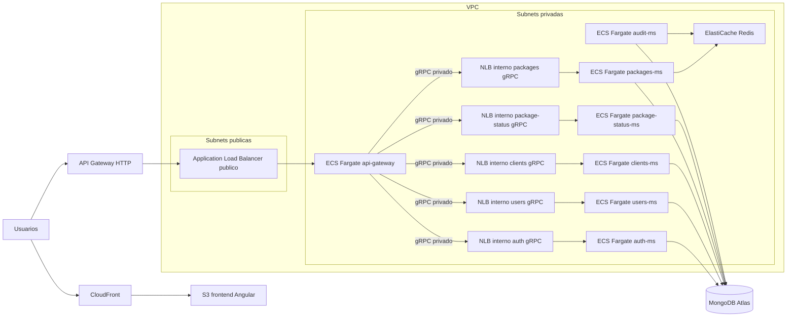

# Despliegue en AWS

Este documento describe una forma productiva de desplegar Enviexpress en AWS manteniendo la arquitectura del repositorio: frontend Angular, API Gateway NestJS, microservicios NestJS por dominio, MongoDB, Redis Pub/Sub y comunicacion interna por gRPC.

## Vista general



## Contenedores y Amazon ECR

Cada Dockerfile del backend se publica como una imagen independiente en Amazon ECR:

| Servicio | Dockerfile | Repositorio ECR sugerido |
| --- | --- | --- |
| API Gateway | `backend/dockerfiles/api-gateway.Dockerfile` | `enviexpress/api-gateway` |
| Auth | `backend/dockerfiles/auth-ms.Dockerfile` | `enviexpress/auth-ms` |
| Users | `backend/dockerfiles/users-ms.Dockerfile` | `enviexpress/users-ms` |
| Clients | `backend/dockerfiles/clients-ms.Dockerfile` | `enviexpress/clients-ms` |
| Packages | `backend/dockerfiles/packages-ms.Dockerfile` | `enviexpress/packages-ms` |
| Package Status | `backend/dockerfiles/package-status-ms.Dockerfile` | `enviexpress/package-status-ms` |
| Audit | `backend/dockerfiles/audit-ms.Dockerfile` | `enviexpress/audit-ms` |
| Frontend | `frontend/Dockerfile` | `enviexpress/frontend` si se sirve como contenedor |

La recomendacion para el frontend es compilar Angular y publicar los assets en S3 + CloudFront. El contenedor `frontend` queda util para despliegue homogeneo, demos o ambientes donde se prefiera servir Nginx desde ECS.

Buenas practicas para ECR:

- Etiquetar imagenes con `git SHA`, version semantica y ambiente, por ejemplo `api-gateway:1.0.0-a1b2c3d`.
- Activar escaneo de vulnerabilidades.
- Habilitar politicas de lifecycle para retener solo las ultimas N imagenes por ambiente.
- No incluir secretos en la imagen; todo secreto entra por Secrets Manager o SSM Parameter Store.

## ECS Fargate

La aplicacion se despliega en un cluster ECS con launch type Fargate. Cada microservicio debe ser un ECS Service separado para poder escalar, reiniciar y desplegar de forma independiente.

Servicios recomendados:

- `api-gateway`: unico backend HTTP expuesto al balanceador.
- `auth-ms`, `users-ms`, `clients-ms`, `packages-ms`, `package-status-ms`: servicios privados con puerto gRPC interno.
- `audit-ms`: servicio privado que consume eventos de Redis y persiste auditoria.

Cada ECS Task Definition define:

- Imagen ECR del servicio.
- CPU y memoria iniciales, por ejemplo `0.25 vCPU / 512 MB` para servicios pequenos y `0.5 vCPU / 1 GB` para `api-gateway` o `packages-ms`.
- Variables no sensibles como `NODE_ENV`, `API_PREFIX`, `LOG_LEVEL`, puertos y URLs internas.
- Secretos como `JWT_ACCESS_SECRET`, `MONGO_URI` y credenciales, referenciados desde Secrets Manager.
- Logs a CloudWatch Logs con un grupo por servicio.
- Health checks por contenedor cuando el servicio exponga endpoint HTTP; para gRPC se puede usar un health endpoint interno o checks TCP a nivel de ECS/ALB interno.

## Balanceadores de carga y exposicion

La exposicion publica debe limitarse al minimo:

- Frontend: S3 + CloudFront.
- Backend HTTP: API Gateway de AWS o CloudFront apunta al ALB publico.
- API Gateway NestJS: unico contenedor backend accesible desde el ALB.
- Microservicios gRPC: nunca publicos; reciben trafico a traves de balanceadores internos dentro de la VPC.
- MongoDB y Redis: nunca publicos.

Flujo recomendado:

1. El navegador carga Angular desde CloudFront.
2. Angular consume `/api` por un dominio publico, por ejemplo `api.enviexpress.com`.
3. AWS API Gateway aplica TLS, throttling, WAF opcional y rutas publicas.
4. API Gateway de AWS reenvia al ALB.
5. El ALB enruta solo hacia el ECS Service `api-gateway`.
6. `api-gateway` llama a cada microservicio por gRPC usando el DNS privado del balanceador interno correspondiente.
7. Cada balanceador interno distribuye trafico entre las tasks sanas del ECS Service asociado.

Si se quiere simplificar para una prueba tecnica, se puede omitir AWS API Gateway y exponer directamente el ALB con TLS + WAF. Para produccion, API Gateway agrega throttling, cuotas, autorizadores, logging de borde y control mas fino de exposicion.

### Balanceadores internos para gRPC

Entre el API Gateway NestJS y los microservicios se recomienda usar Network Load Balancers internos, uno por microservicio gRPC:

| Microservicio | Listener interno | Target group ECS | Variable usada por `api-gateway` |
| --- | --- | --- | --- |
| `auth-ms` | `auth-grpc.internal:50051` | tasks de `auth-ms` | `GRPC_AUTH_URL` |
| `users-ms` | `users-grpc.internal:50052` | tasks de `users-ms` | `GRPC_USERS_URL` |
| `clients-ms` | `clients-grpc.internal:50053` | tasks de `clients-ms` | `GRPC_CLIENTS_URL` |
| `packages-ms` | `packages-grpc.internal:50054` | tasks de `packages-ms` | `GRPC_PACKAGES_URL` |
| `package-status-ms` | `package-status-grpc.internal:50055` | tasks de `package-status-ms` | `GRPC_PACKAGE_STATUS_URL` |

El NLB interno es adecuado para gRPC porque opera en capa 4, soporta conexiones largas y no expone los servicios fuera de la VPC. Cada ECS Service registra sus tasks en su target group con target type `ip`, que es el modo correcto para Fargate.

Puntos de configuracion:

- Crear un NLB interno por microservicio o un NLB interno compartido con listeners/target groups separados por puerto.
- Asociar cada ECS Service a su target group para que ECS registre nuevas tasks y retire tasks al hacer scale in, deploy o reemplazo por fallo.
- Configurar health checks TCP o gRPC/HTTP si se agrega endpoint de health compatible.
- Publicar un DNS privado por servicio con Route 53 Private Hosted Zone o usar el DNS interno del NLB.
- Mantener idle timeout y keepalive compatibles con clientes gRPC.
- No enrutar `audit-ms` desde el gateway si solo consume eventos; si en el futuro expone consultas administrativas por gRPC, se agrega su propio NLB interno y target group.

## Autoescalado

Cada ECS Service debe tener Application Auto Scaling configurado de forma independiente.

Politicas iniciales sugeridas:

| Servicio | Min | Max | Metrica principal |
| --- | --- | --- | --- |
| `api-gateway` | 2 | 6 | CPU 60%, request count del ALB, latencia p95 |
| `packages-ms` | 2 | 6 | CPU 60%, cambios de estado por minuto, errores |
| `package-status-ms` | 2 | 8 | CPU 60%, volumen de consultas |
| `auth-ms` | 2 | 4 | CPU 60%, logins por minuto |
| `users-ms` | 1 | 3 | CPU 60% |
| `clients-ms` | 1 | 4 | CPU 60% |
| `audit-ms` | 1 | 4 | backlog de acciones pendientes/fallidas y eventos procesados |

El escalado por CPU es suficiente para empezar, pero los servicios asincronos necesitan metricas de negocio: acciones derivadas pendientes, eventos procesados por minuto y cantidad de fallos. Redis Pub/Sub no conserva backlog, asi que la fuente confiable para recuperacion sigue siendo MongoDB con acciones `PENDING` o `FAILED`.

Cuando un microservicio escala horizontalmente, ECS registra automaticamente las nuevas tasks en el target group del NLB interno. El API Gateway NestJS no necesita conocer cuantas instancias existen; solo consume el DNS privado del balanceador. Esto mantiene desacoplados el cliente gRPC y el ciclo de vida de cada microservicio.

## Redis en AWS

Redis debe desplegarse como Amazon ElastiCache for Redis dentro de subnets privadas.

Uso en esta solucion:

- Broker Pub/Sub para eventos de dominio.
- Desacoplar acciones derivadas y auditoria de la respuesta HTTP principal.
- Evitar que el cambio de estado de paquete bloquee por tareas secundarias.

Configuracion recomendada:

- Cluster privado, sin acceso publico.
- TLS habilitado si el plan/region lo soporta.
- Auth token administrado en Secrets Manager.
- Security Group que permita `6379` solo desde los Security Groups de los ECS Services.
- Multi-AZ para produccion.
- Alarmas de CPU, memoria, conexiones, evictions y errores.

Nota operativa: Redis Pub/Sub no garantiza entrega persistente. Para mayor robustez futura, se puede migrar a Redis Streams, SQS, SNS/SQS, EventBridge, RabbitMQ o Kafka. En esta entrega se mitiga guardando acciones derivadas en MongoDB y permitiendo reproceso.

## MongoDB administrado por MongoDB

La base de datos se recomienda en MongoDB Atlas, no como contenedor propio en ECS. Atlas provee replica set, backups, monitoreo, escalado, cifrado y mantenimiento administrado.

Configuracion recomendada:

- Cluster replica set en la misma region AWS del backend.
- Conexion privada mediante VPC Peering o AWS PrivateLink entre la VPC de AWS y Atlas.
- IP allowlist restringida a la red privada cuando aplique.
- Backups automaticos con point-in-time recovery.
- Cifrado en reposo y TLS en transito.
- Usuarios de base de datos por ambiente con privilegios minimos.
- Indices creados/versionados por scripts o migraciones controladas.

MongoDB es la fuente de verdad para usuarios, clientes, paquetes, historial, acciones derivadas y auditoria. Redis no debe contener datos indispensables sin respaldo en MongoDB.

## VPC, subnets y seguridad de red

La VPC debe separar recursos publicos y privados:

- Subnets publicas: ALB publico, NAT Gateways si se necesitan salidas a internet desde subnets privadas.
- Subnets privadas: ECS Fargate, ElastiCache Redis y conectividad privada a MongoDB Atlas.
- Internet Gateway: solo para recursos publicos.
- NAT Gateway: salida controlada desde ECS para descargar dependencias externas o comunicarse con servicios AWS si no se usan VPC endpoints.
- VPC endpoints: ECR, CloudWatch Logs, Secrets Manager y SSM para reducir trafico por NAT.

Security Groups:

- `alb-sg`: entrada `443` desde internet; salida solo al `api-gateway-sg`.
- `api-gateway-sg`: entrada desde `alb-sg`; salida a los NLB internos gRPC, Redis si aplica y MongoDB si aplica.
- `grpc-nlb-sg`: entrada gRPC solo desde `api-gateway-sg`; salida a los Security Groups de los microservicios.
- `internal-ms-sg`: entrada gRPC solo desde `grpc-nlb-sg` o desde otros servicios autorizados.
- `redis-sg`: entrada `6379` solo desde servicios que publican/consumen eventos.
- Atlas: acceso solo por PrivateLink/VPC peering o rangos privados definidos.

## API Gateway y rutas publicas

Aunque existe un API Gateway NestJS dentro de la solucion, AWS API Gateway puede actuar como capa perimetral administrada.

Responsabilidades del AWS API Gateway:

- Exponer solo `/api/*` hacia el backend.
- TLS administrado con ACM.
- Throttling por ruta o por cliente.
- Logs de acceso.
- Integracion con WAF si se requiere proteccion basica ante bots o ataques comunes.

Responsabilidades del API Gateway NestJS:

- Contrato REST/OpenAPI del dominio.
- Autenticacion JWT y RBAC de aplicacion.
- CORS.
- Validacion de DTOs.
- Orquestacion hacia microservicios gRPC privados.

No se deben publicar puertos gRPC ni endpoints de microservicios directamente en internet.

## Variables y secretos

Variables sensibles:

- `JWT_ACCESS_SECRET`
- `MONGO_URI`
- Credenciales MongoDB Atlas
- `REDIS_URL` si contiene auth token

Estas variables deben ir en AWS Secrets Manager. Variables no sensibles pueden ir en SSM Parameter Store o directamente en la task definition.

Variables internas relevantes:

```text
GRPC_AUTH_URL=auth-grpc.internal:50051
GRPC_USERS_URL=users-grpc.internal:50052
GRPC_CLIENTS_URL=clients-grpc.internal:50053
GRPC_PACKAGES_URL=packages-grpc.internal:50054
GRPC_PACKAGE_STATUS_URL=package-status-grpc.internal:50055
REDIS_URL=rediss://<elasticache-private-endpoint>:6379
MONGO_URI=mongodb+srv://<atlas-private-endpoint>/enviexpress
```

Los nombres internos pueden resolverse con Route 53 Private Hosted Zone apuntando a los NLB internos. ECS Service Connect o AWS Cloud Map tambien son opciones validas, pero si se quiere que el balanceo lo gestione un recurso explicito de AWS, los NLB internos con target groups por servicio dejan el comportamiento mas claro.

## CI/CD sugerido

Pipeline por ambiente:

1. Instalar dependencias.
2. Ejecutar lint y pruebas.
3. Construir cada imagen Docker.
4. Escanear imagenes.
5. Publicar imagenes en ECR.
6. Actualizar task definitions con el nuevo tag.
7. Desplegar ECS Services con rolling deployment o blue/green.
8. Ejecutar smoke tests contra `/api/health` y endpoints criticos.
9. Promocionar a produccion con aprobacion manual.

Para el frontend:

1. Construir Angular.
2. Publicar `dist/` en S3.
3. Invalidar CloudFront.

## Observabilidad y operacion

Minimo esperado:

- CloudWatch Logs por servicio.
- Metricas ECS: CPU, memoria, reinicios, task count.
- Metricas ALB/API Gateway: request count, 4xx, 5xx, latencia p95/p99.
- Metricas de dominio: cambios de estado, acciones derivadas pendientes/fallidas, eventos procesados.
- Alarmas para error rate alto, latencia alta, caida de tasks, Redis sin memoria, MongoDB con conexiones altas o storage bajo.
- `requestId` propagado desde frontend/API Gateway hacia gRPC, eventos Redis, auditoria y logs.

## Backups y recuperacion

- MongoDB Atlas con backups automaticos y point-in-time recovery.
- Prueba periodica de restauracion en ambiente aislado.
- Redis sin rol de fuente de verdad; las acciones pendientes/fallidas en MongoDB permiten reproceso.
- Definir RPO/RTO por ambiente.
- Exportar logs de auditoria si hay requerimientos de retencion legal.

## Que podria estar faltando

La propuesta cubre computo, red, registros de contenedores, escalado, cache/eventos, base de datos y exposicion. Para una entrega mas completa de produccion agregaria:

- IaC con Terraform, AWS CDK o CloudFormation para que la infraestructura sea reproducible.
- Ambiente `staging` separado de `production`.
- WAF delante de API Gateway/CloudFront.
- ACM + Route 53 para dominios y certificados.
- Estrategia blue/green o canary para despliegues.
- Health endpoint real por servicio y endpoint `/api/health` en el gateway.
- Health checks especificos para gRPC en los target groups internos.
- Politicas IAM de minimo privilegio por task.
- Retencion de logs y politicas de privacidad para datos sensibles.
- Gestion de migraciones/indices de MongoDB por version.
- Plan de reproceso para acciones derivadas `PENDING` o `FAILED`.
- Presupuestos y alertas de costo.
- Documentacion de RPO/RTO, runbooks y procedimiento de rollback.
